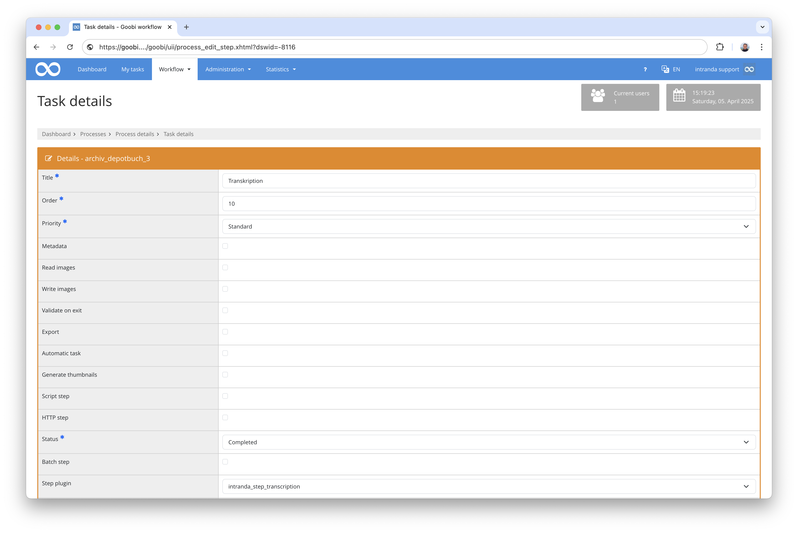
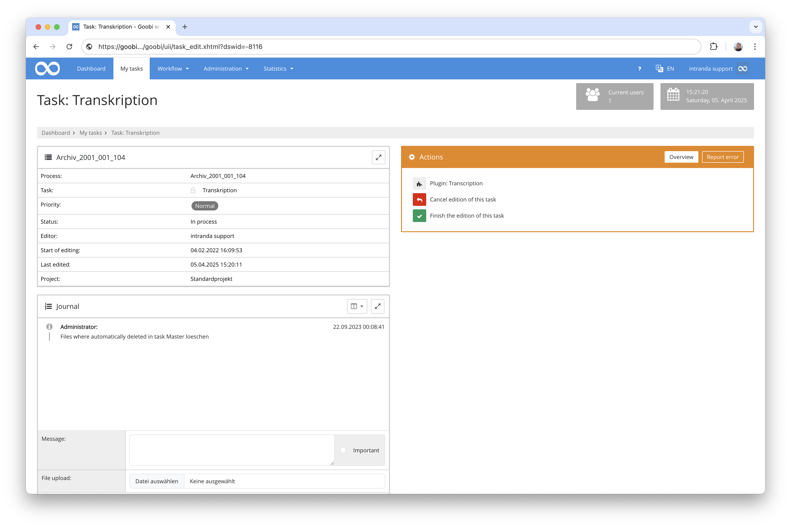

## Introduction
The transcription plugin allows the user to edit the txt OCR results of a Goobi process. An image and a rich text editor are displayed side by side where the text can be captured.


## Installation
To use the plugin, these two files must be copied to the following locations:

```bash
/opt/digiverso/goobi/plugins/step/plugin-intranda-step-transcription-base.jar
/opt/digiverso/goobi/plugins/GUI/plugin-intranda-step-transcription-gui.jar
```

The configuration of the plugin takes place within its configuration file `plugin_intranda_step_transcription.xml`. This is expected under the following path:

```bash
/opt/digiverso/goobi/config/plugin_intranda_step_transcription.xml
```


## Overview and functionality
To put the plugin into operation, it must be activated for one or more desired tasks in the workflow. This is done as shown in the following screenshot by selecting the plugin `intranda_step_transcription` from the list of installed plugins.



As soon as a user subsequently accepts a task that contains this plugin, he can enter it from within the task.



After entering the plugin, the user can browse through the image files. A rich text editor is displayed on the right-hand side of each page, showing any existing transcription or OCR results. In this editor, the previous result can now be corrected or a completely new text can be transcribed.


**ATTENTION:** Please note that this plugin only allows a simple transcription of page content. It is not possible to enter coordinates for paragraphs, lines or words.


## Configuration
The plugin is configured in the file `plugin_intranda_step_transcription.xml` as shown here:

{{CONFIG_CONTENT}}

{{CONFIG_DESCRIPTION_PROJECT_STEP}}

Parameter               | Explanation
------------------------|------------------------------------
`imageFolder`           | Specify here from which directory the images are to be displayed. Possible values are e.g. `master`, `media` or individual folders like `photos` and `scans`.
`allowTaskFinishButtons` | This parameter can be used to enable buttons for completing the task to be displayed in the regular plugin interface so that the plugin does not have to be exited first.
